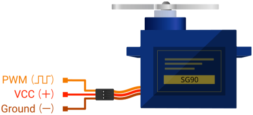

# SG90 Servo

来源：
- FriendlyWire PDF: https://friendlywire.com/projects/ne555-servo-safe/SG90-datasheet.pdf

说明：
- 这份 PDF 汇总了多页 `SG90`、`Tower Pro SG90` 和相近 `9g` 微型舵机资料
- 后半部分还混入了 `TG9e` 等相近型号，所以参数并不是所有页面都完全一致
- 本页优先整理前几页中更常见、也更适合做入门参考的 `SG90` 数据

## 接线与引脚说明

| 线色 | 名称 | 说明 |
|---|---|---|
| Red | V+ | 电源正端，常接 `4.8V ~ 5V` |
| Brown | GND | 地 |
| Orange | Signal | 控制信号输入 |

## 基本参数

| 项目 | 值 |
|---|---|
| 名称 | SG90 Servo / 9g Micro Servo |
| 类型 | Analog Micro Servo |
| 重量 | 约 `9 g` |
| 常见尺寸参考 1 | 约 `22.2 x 11.8 x 31 mm` |
| 常见尺寸参考 2 | 约 `23.1 x 12.2 x 29.0 mm` |
| 旋转范围 | 约 `180°` |
| 失速扭矩 | 常见参考 `1.8 kgf·cm @ 4.8V` |
| 工作速度 | 常见参考 `0.10 s / 60° @ 4.8V` |
| 工作电压 | 常见参考 `4.8V`，部分页面给出 `4.0V ~ 7.2V` |
| 死区宽度 | 常见参考 `10 us` |
| 齿轮类型 | Plastic Gear |
| 电机类型 | 3-pole Motor |
| 温度范围 | `0°C ~ 55°C` |

## 控制方式

| 项目 | 说明 | 常见参考 |
|---|---|---|
| 脉冲周期 | 控制脉冲循环周期 | 约 `20 ms` |
| 中位脉冲 | 舵机中间位置 | 约 `1.5 ms` |
| 一侧端点 | 一侧接近极限位置 | 约 `1.0 ms` |
| 另一侧端点 | 另一侧接近极限位置 | 约 `2.0 ms` |
| 扩展脉宽范围 | 某些页面给出更宽控制范围 | `500 us ~ 2400 us` |

## 使用方式

| 方式 | 说明 | 常见用途 |
|---|---|---|
| MCU PWM 控制 | 用定时器输出控制脉冲 | 角度控制、转向、云台 |
| 固定角度定位 | 输出某个固定脉宽后停在对应角度 | 挡板、拨杆、舵机臂定位 |
| 周期摆动 | 让脉宽在两个值之间变化 | 扫描、往复运动、演示机构 |

## 使用注意

| 项目 | 说明 |
|---|---|
| 供电 | 不建议直接从 MCU IO 供电，通常需要独立 `5V` 电源或足够电流的稳压输出 |
| 共地 | 舵机电源地与 MCU 地通常需要共地 |
| 启动电流 | 起动和堵转时电流会明显高于空载状态 |
| 机械负载 | 卡死、撞限位或机构阻力大时损坏风险会明显增加 |
| 型号差异 | 相近 `9g` 舵机外观相似，但线序、扭矩、尺寸可能有差异 |

## 适合从 PDF 截哪些图

| 内容 | 建议 | 说明 |
|---|---|---|
| 外形尺寸图 | 优先截图 | 适合放到 `images/internal/` |
| 三线接线说明 | 优先截图 | 红/棕/橙三线定义很实用 |
| 舵盘与配件图 | 可选截图 | 用于补充器件外观理解 |

## 图片目录预留

- `images/pinout/`：接线图、线色图
- `images/internal/`：尺寸图、结构图
- `images/application/`：接线示例、MCU 控制示意
