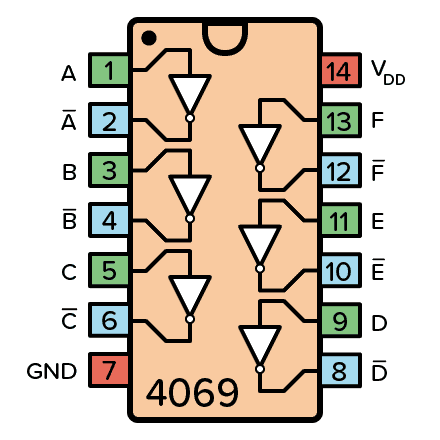
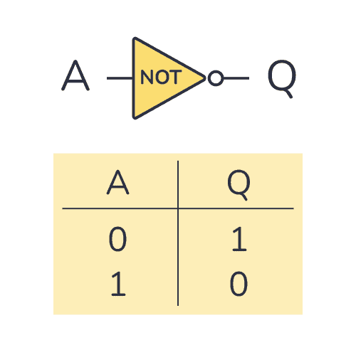
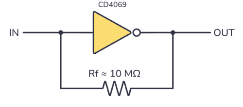

# CD4069

来源：
- Build Electronic Circuits: https://www.build-electronic-circuits.com/4000-series-integrated-circuits/ic-4069/

## Pin 图与引脚说明

| 引脚 | 名称 | 说明 |
|---|---|---|
| 1 | 1A | 第 1 个反相器输入 |
| 2 | 1Y | 第 1 个反相器输出 |
| 3 | 2A | 第 2 个反相器输入 |
| 4 | 2Y | 第 2 个反相器输出 |
| 5 | 3A | 第 3 个反相器输入 |
| 6 | 3Y | 第 3 个反相器输出 |
| 7 | GND | 地 |
| 8 | 4Y | 第 4 个反相器输出 |
| 9 | 4A | 第 4 个反相器输入 |
| 10 | 5Y | 第 5 个反相器输出 |
| 11 | 5A | 第 5 个反相器输入 |
| 12 | 6Y | 第 6 个反相器输出 |
| 13 | 6A | 第 6 个反相器输入 |
| 14 | VDD | 电源正端 |

## 基本参数

| 项目 | 值 |
|---|---|
| 型号 | CD4069 |
| 类型 | Hex Inverter / CMOS Logic IC |
| 逻辑功能 | 六个独立反相器 |
| 电源 | VDD / GND |
| 封装 | DIP-14 等常见逻辑封装 |
| 常见用途 | 逻辑反相、波形整形、振荡、简单模拟应用 |

## 使用方式

| 方式 | 说明 | 常见用途 |
|---|---|---|
| 逻辑反相 | 输入高电平输出低电平，输入低电平输出高电平 | 数字逻辑反相 |
| 波形整形 | 利用反相器门电路改善信号边沿 | 按键信号、方波整形 |
| RC 振荡/延时 | 与电阻电容搭配形成简单振荡或延时网络 | 简单时钟、振荡器 |
| 模拟放大示例 | 来源页展示了基于 CD4069 的放大电路 | 简单音频或信号实验 |

## 内部/逻辑参考图

## 实际案例图

## 备注

- 本页优先复用了来源页现成图片
- `CD4069` 是六个独立反相器，不是单个 NOT 门
- 实际使用前建议再结合具体厂家数据手册确认电气参数和封装版本
