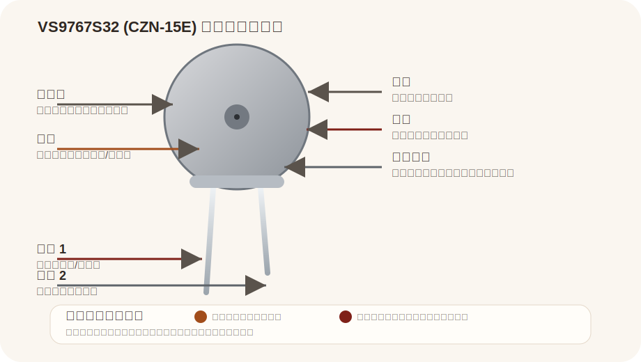

# VS9767S32 (CZN-15E)

来源：
- Quartz1 PDF: https://www.quartz1.com/price/techdata/VS9767S32(CZN-15E).pdf

## Pin 图与引脚说明

| 引脚/部分 | 名称 | 说明 |
|---|---|---|
| 顶部开孔 | Sound Port | 用于接收声音 |
| 端子 1 | Output / Bias | 常作为信号输出与偏置端 |
| 端子 2 | GND / Case Side | 常与地或外壳相关 |

## 基本参数

| 项目 | 值 |
|---|---|
| 型号 | VS9767S32 (CZN-15E) |
| 类型 | Electret Condenser Microphone |
| 尺寸 | 约 9.7 mm 直径 |
| 标准工作电压 | 4.5VDC |
| 工作电压范围 | 1VDC - 10VDC |
| 标准负载阻抗 | 2.2kΩ |
| 最大工作电流 | 0.5mA |
| 灵敏度 | -32dB ± 3dB |
| 指向性 | Omnidirectional |
| 频率范围 | 50Hz - 16kHz |
| 信噪比 | 58dBA |
| 最大声压级 | 110dB |

## 使用方式

| 方式 | 说明 | 常见用途 |
|---|---|---|
| 声音采集 | 经偏置电阻接入放大或采样电路 | 简单录音、语音采集 |
| 模块前端 | 作为驻极体咪头接前置放大器 | 声控模块、麦克风板 |
| 环境检测 | 采集环境声音强度变化 | 声音检测、触发控制 |

## 备注

- 这是驻极体咪头，不是数字麦克风
- 接线前应先确认端子定义与外壳关系
- 本页参数按 PDF 摘要整理，实际设计请以原始规格书为准
