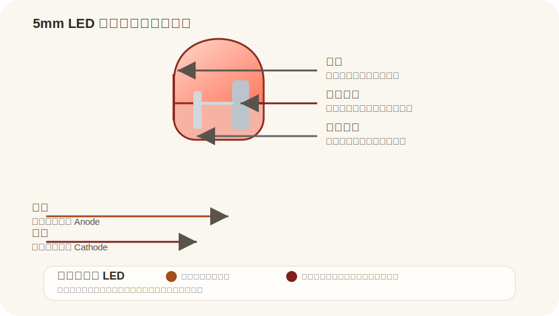

# 5mm Round LED

来源：
- Components101: https://components101.com/diodes/5mm-round-led

## Pin 图与引脚说明

| 引脚 | 名称 | 说明 |
|---|---|---|
| 长脚 | Anode | 正极，通常串联限流电阻后接电源或 GPIO |
| 短脚 | Cathode | 负极，常接地或接到灌电流输出端 |

## 基本参数

| 项目 | 值 |
|---|---|
| 名称 | 5mm Round LED |
| 类型 | 直插发光二极管 |
| 封装 | THT 5mm |
| 极性 | 有极性 |
| 正向压降 | 约 1.8V - 3.3V |
| 工作电流 | 常见 5mA - 20mA |
| 外观识别 | 长脚、短脚、壳体平边、内部电极大小 |

## 使用方式

| 方式 | 说明 | 常见用途 |
|---|---|---|
| 直流点亮 | 串联限流电阻后正向导通 | 电源指示、状态灯 |
| GPIO 驱动 | MCU 通过限流电阻控制亮灭 | 板载指示、调试输出 |
| 脉冲驱动 | 以 PWM 或脉冲方式控制亮度 | 呼吸灯、亮度控制 |

## 备注

- LED 是有极性的，接反通常不会正常点亮
- 剪脚后优先通过平边和内部金属片判断负极
- 使用时不要省略限流电阻
