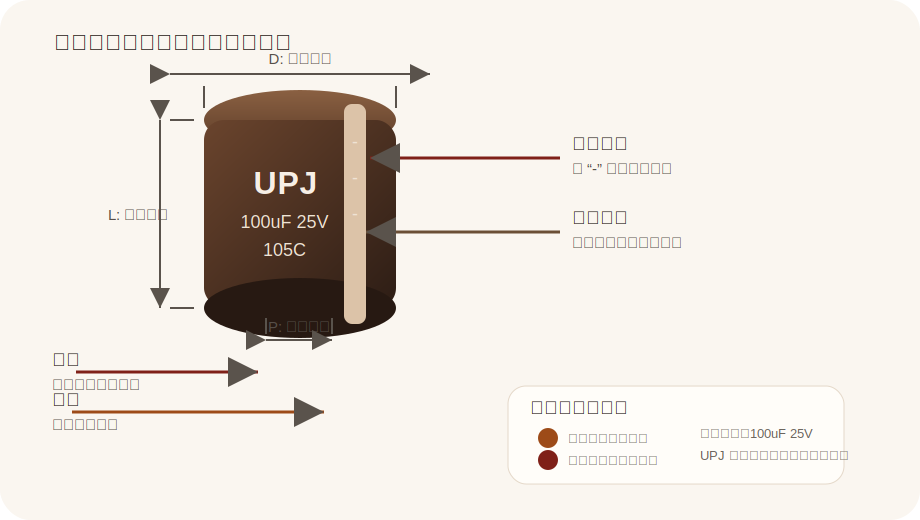

# Aluminum Electrolytic Capacitor

来源：
- Nichicon UPJ PDF: https://www.nichicon.co.jp/products/pdfs/upj.pdf

## Pin 图与引脚说明

| 引脚 | 名称 | 说明 |
|---|---|---|
| 正极 | Anode | 一般对应较长引脚，接电源正极或滤波节点正端 |
| 负极 | Cathode | 一般对应较短引脚，壳体带 `-` 色带的一侧对应此端 |

| 外观识别 | 说明 |
|---|---|
| 是否区分正负极 | 区分，这是有极性铝电解电容 |
| 长短脚 | 常见识别方式是长脚为正极、短脚为负极 |
| 壳体色带 | 带 `-` 标记的色带一侧为负极 |
| 壳体印字 | 常见可读到系列名、容量、耐压、温度等信息 |

## 基本参数

| 项目 | 值 |
|---|---|
| 类型 | 铝电解电容，径向引线 |
| 参考系列 | Nichicon UPJ |
| 参考厂家 | Nichicon |
| 系列特点 | Low Impedance / High Reliability / 105C |
| 额定电压范围 | 6.3V - 450V |
| 标称电容量范围 | 1uF - 15000uF |
| 电容量容差 | ±20% |
| 工作温度 | -55°C - 105°C 或 -40°C - 105°C |
| 寿命 | 105°C 下 2000h / 3000h / 5000h，依规格而定 |
| 引脚形式 | Radial Lead Type |
| 套管颜色 | Dark Brown Sleeve |

## 使用方式

| 方式 | 说明 | 常见用途 |
|---|---|---|
| 输出滤波 | 与整流或开关电源输出端并联，降低纹波 | 开关电源输出滤波 |
| 储能缓冲 | 为负载瞬态提供电流，减小电压跌落 | 电源输入缓冲、板级母线 |
| 低阻抗滤波 | 利用低阻抗特性改善高频纹波表现 | DC-DC、电源模块 |

## 备注

- 本页按“铝电解电容”类型整理，参数参考了 Nichicon 的 UPJ 系列资料
- 图中 `100uF 25V` 是示意写法，用来说明壳体印字如何查看
- 选型时需要再按 PDF 中的尺寸表确认 `D`、`L`、`P`、纹波电流和具体寿命
- 极性器件，使用时不能反接
