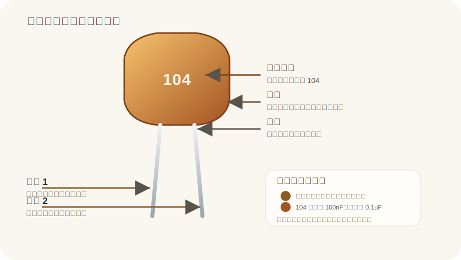

# Ceramic Capacitor

来源：
- EEPower: https://eepower.com/capacitor-guide/types/ceramic-capacitor/

## Pin 图与引脚说明

| 引脚 | 名称 | 说明 |
|---|---|---|
| 引脚 1 | Terminal 1 | 无极性，与另一端可互换 |
| 引脚 2 | Terminal 2 | 无极性，与另一端可互换 |

## 基本参数

| 项目 | 值 |
|---|---|
| 名称 | Ceramic Capacitor |
| 类型 | 陶瓷电容 |
| 极性 | 无极性 |
| 常见标识 | 104、103、102 等 |
| 104 含义 | 100nF / 0.1uF |
| 常见用途 | 去耦、旁路、耦合、滤波 |
| 常见封装 | 圆片、浸塑、MLCC |

## 使用方式

| 方式 | 说明 | 常见用途 |
|---|---|---|
| 去耦 | 靠近芯片电源脚并联在 VCC 和 GND 之间 | MCU、数字芯片供电去耦 |
| 高频旁路 | 吸收高频噪声和尖峰 | 电源噪声抑制 |
| 耦合/滤波 | 与电阻或其他器件组成 RC 网络 | 模拟和数字信号处理 |

## 备注

- 陶瓷电容通常无极性
- `104` 是很常见的容量标识，表示 100nF
- 不同封装和介质材料会影响容量稳定性、温漂和耐压表现
