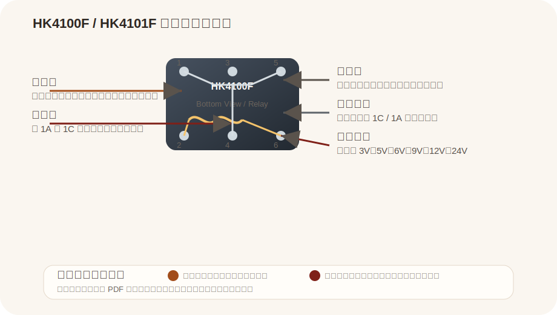

# HK4100F / HK4101F

来源：
- Ozdisan PDF: https://img.ozdisan.com/ETicaret_Dosya/445413_4369639.pdf

## Pin 图与引脚说明

| 引脚/部分 | 名称 | 说明 |
|---|---|---|
| Coil | 线圈脚 | 给线圈加额定电压后，继电器动作 |
| COM | 公共端 | 转换触点的公共端 |
| NO | Normally Open | 常开触点，动作后闭合 |
| NC | Normally Closed | 常闭触点，动作后断开 |

## 基本参数

| 项目 | 值 |
|---|---|
| 型号 | HK4100F / HK4101F |
| 类型 | Subminiature Signal Relay |
| 触点形式 | 1C / 1A（按订货信息） |
| 线圈类型 | DC |
| 线圈电压 | 3V / 5V / 6V / 9V / 12V / 24V |
| 线圈功率 | 0.36W / 0.15W / 0.2W（按选型） |
| 开关能力 | 3A switching capability |
| 外形尺寸 | 15.5 x 10.5 x 11.8 mm |
| 封装安装 | PCB |

## 使用方式

| 方式 | 说明 | 常见用途 |
|---|---|---|
| 信号切换 | 用线圈驱动触点切换信号回路 | 小信号切换 |
| 低功率负载控制 | 通过触点切换小电流/低功率负载 | 接口隔离、控制板 |
| PCB 板载继电器 | 直接焊接在电路板上使用 | 小型控制模块 |

## 备注

- 这是小型信号继电器，不是大功率电源继电器
- PDF 给出了不同触点形式和线圈功率选项，具体使用前要确认订货型号
- 资料中的引脚理解应以底视图为准
