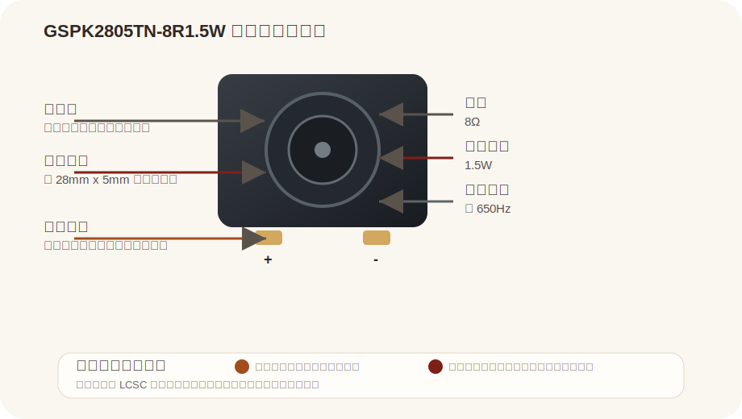

# GSPK2805TN-8R1.5W

来源：
- LCSC: https://www.lcsc.com/product-detail/C530552.html

## Pin 图与引脚说明

| 引脚/部分 | 名称 | 说明 |
|---|---|---|
| 正面中心 | Sound Outlet | 声音输出面 |
| + | Positive Pad | 一侧焊盘端子 |
| - | Negative Pad | 另一侧焊盘端子 |

## 基本参数

| 项目 | 值 |
|---|---|
| 型号 | GSPK2805TN-8R1.5W |
| 类型 | Speaker |
| 阻抗 | 8Ω |
| 额定功率 | 1.5W |
| 谐振频率 | 650Hz |
| 声压级 | 100dB |
| 尺寸 | 28mm x 5mm |
| 安装方式 | 焊盘连接 |

## 使用方式

| 方式 | 说明 | 常见用途 |
|---|---|---|
| 音频输出 | 接音频功放或驱动电路输出声音 | 提示音、语音播放 |
| 模块配套发声 | 作为板载扬声器 | 小型终端、语音模块 |
| 简单提示系统 | 输出蜂鸣或音效 | 报警、通知、交互反馈 |

## 备注

- 本页按 LCSC 商品页参数整理
- 实际使用前建议确认焊盘尺寸、安装方式和驱动能力
- 若用于 MCU 直接驱动，通常需要额外功放或驱动级
