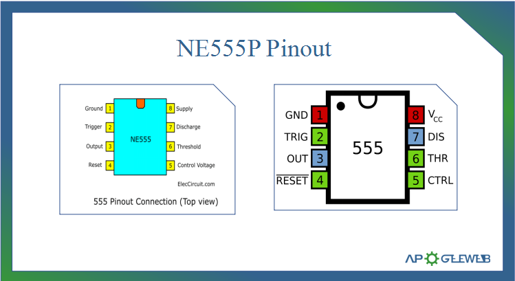

# NE555P

来源：
- Kynix: https://www.kynix.com/components/ne555p-pinout-datasheet-features-applications.html#ne555p-pinout

## Pin 图与引脚说明

| 引脚 | 名称 | 说明 |
|---|---|---|
| 1 | GND | 地 |
| 2 | TRIG | 触发输入，低于约 1/3 VCC 时触发 |
| 3 | OUT | 输出 |
| 4 | RESET | 低电平复位，正常使用时通常接高电平 |
| 5 | CTRL | 控制电压输入，常接小电容到地 |
| 6 | THRES | 阈值输入，高于约 2/3 VCC 时复位输出 |
| 7 | DISCH | 放电脚，与外部 RC 定时网络配合 |
| 8 | VCC | 电源正端 |

## 基本参数

| 项目 | 值 |
|---|---|
| 型号 | NE555P |
| 类型 | Precision Timer / Standard Timer |
| 制造商 | Texas Instruments |
| 定时器数量 | 1 |
| 电源电压范围 | 4.5V - 16V |
| 页面描述典型供电 | 5V - 15V |
| 工作温度 | 0°C - 70°C |
| 封装 | PDIP-8 |
| 安装方式 | Through Hole |
| 典型工作电流 | 2 mA |
| 输出能力 | 最大 200 mA |

## 使用方式

| 方式 | 说明 | 常见用途 |
|---|---|---|
| Astable Multivibrator | 无稳态振荡，持续输出方波 | 闪灯、方波发生、时钟脉冲 |
| Monostable | 单稳态，触发后输出一个定宽脉冲 | 延时、单次脉冲、按键定时 |
| Voltage Controlled Oscillator | 通过 CTRL 脚改变阈值和频率 | 压控振荡、频率调节 |

## 图片目录预留

- `images/pinout/`：引脚图
- `images/internal/`：内部原理图
- `images/application/`：实际案例图
