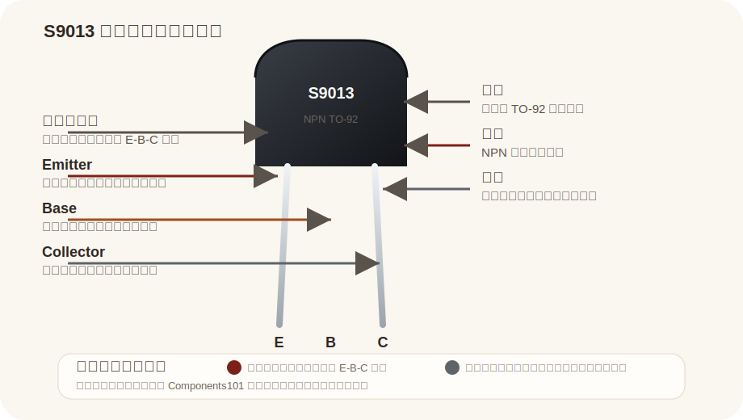

# S9013

来源：
- Components101: https://components101.com/transistors/s9013-transistor

## Pin 图与引脚说明

| 引脚 | 名称 | 说明 |
|---|---|---|
| E | Emitter | 发射极，常接地或低端电流路径 |
| B | Base | 基极，通常通过限流电阻接控制信号 |
| C | Collector | 集电极，常接负载或上拉电源回路 |

## 基本参数

| 项目 | 值 |
|---|---|
| 型号 | S9013 |
| 类型 | NPN Transistor |
| 封装 | TO-92 |
| 集电极电流 | 约 500mA |
| 集电极-发射极电压 | 约 20V |
| 用途 | 开关驱动、小信号放大 |
| 视角说明 | 平边正视图常按 E-B-C 排列 |

## 使用方式

| 方式 | 说明 | 常见用途 |
|---|---|---|
| 开关驱动 | 基极加电阻后驱动导通/关断 | 蜂鸣器、继电器、小负载控制 |
| 小信号放大 | 用作前级或低功率放大 | 音频前级、传感器信号处理 |
| 接口控制 | 将 MCU 小电流信号放大为可驱动负载的电流 | 指示灯组、简单执行器 |

## 备注

- 本页按 `S9013` 型号整理
- 引脚顺序按来源页面整理为平边正视图 `E-B-C`
- 实际使用前建议再对照具体厂家数据手册确认脚位
