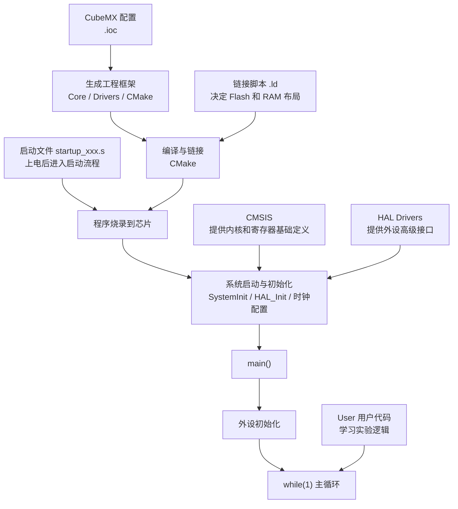

# 项目文件阅读笔记

本文档从“整体架构”的角度帮助理解这个 STM32 学习工程，重点是先建立整体印象，再逐步深入细节。

## 1. 阅读目标

- 知道这个项目如何通过 `CubeMX + VS Code + CMake` 组织起来
- 知道主要文件和目录分别负责什么
- 知道寄存器开发和 HAL 开发分别依赖哪些部分
- 知道最基础的板载 `LED` 点亮过程需要哪些配置

## 2. 初步理解总结

### 2.1 STM32 和 CMSIS

`STM32` 基于 `ARM Cortex-M` 内核，因此工程里需要 `CMSIS` 提供内核定义、中断和异常相关定义，以及芯片寄存器定义基础。

### 2.2 启动文件和链接脚本

芯片上电后，程序不是直接从 `main()` 开始执行，而是先经过启动流程。这里最关键的是两个文件：

- `startup_xxx.s`
  建立中断向量表，复位后进入启动流程，最终跳转到 `main()`
- `.ld`
  告诉链接器 `Flash` 和 `RAM` 的布局，决定代码段、数据段、栈、堆放到哪里

### 2.3 Core 目录的意义

启动之后，系统还需要进行基础初始化，例如系统时钟配置、GPIO 初始化、中断准备和应用入口组织。在当前工程里，这些内容主要位于 `Core/Src` 和 `Core/Inc`。

## 3. 基本流程图



## 4. 文件快速查表

| 文件或目录 | 主要作用 |
|---|---|
| [01-helloworld.ioc](../../01-helloworld.ioc) | `CubeMX` 工程配置文件，保存引脚、时钟、外设等图形化配置 |
| [CMakeLists.txt](../../CMakeLists.txt) | 顶层 `CMake` 文件，告诉 `CMake` 如何组织和编译整个工程 |
| [CMakePresets.json](../../CMakePresets.json) | `CMake` 预设配置，帮助 `VS Code` 和 `CMake` 扩展使用统一构建参数 |
| [Core](../../Core) | `CubeMX` 生成的核心工程代码目录 |
| [main.c](../../Core/Src/main.c) | 应用入口，包含初始化和主循环 |
| [main.h](../../Core/Inc/main.h) | `main.c` 对应头文件，放公共声明和引脚宏定义 |
| [system_stm32f1xx.c](../../Core/Src/system_stm32f1xx.c) | 系统初始化和 `SystemCoreClock` 维护 |
| [stm32f1xx_it.c](../../Core/Src/stm32f1xx_it.c) | 中断服务函数文件 |
| [stm32f1xx_hal_conf.h](../../Core/Inc/stm32f1xx_hal_conf.h) | HAL 模块配置文件，决定启用哪些 HAL 驱动 |
| [Drivers](../../Drivers) | 官方驱动目录，包含 `CMSIS` 和 `HAL` |
| [Drivers/CMSIS](../../Drivers/CMSIS) | Cortex-M 和芯片寄存器相关定义，是寄存器开发的重要基础 |
| [Drivers/STM32F1xx_HAL_Driver](../../Drivers/STM32F1xx_HAL_Driver) | ST 提供的 HAL 驱动源码 |
| [User](../../User) | 用户自定义代码目录 |
| [cmake](../../cmake) | `CubeMX` 生成的 CMake 辅助配置目录 |
| [cmake/stm32cubemx/CMakeLists.txt](../../cmake/stm32cubemx/CMakeLists.txt) | `CubeMX` 自动生成部分的构建说明 |
| [build](../../build) | 编译输出目录，保存 `.elf`、`.map` 和中间文件 |
| [.vscode](../../.vscode) | `VS Code` 工程配置目录 |
| [.settings](../../.settings) | ST 插件与工程相关的附加配置目录 |
| [startup_stm32f103xb.s](../../startup_stm32f103xb.s) | 启动文件，定义向量表并在复位后进入启动流程 |
| [STM32F103XX_FLASH.ld](../../STM32F103XX_FLASH.ld) | 链接脚本，决定程序在 Flash 和 RAM 中的布局 |

## 5. 寄存器开发和 HAL 开发

### 5.1 如果是寄存器开发

如果使用寄存器开发，核心只需要这些基础部分：

- 启动文件
- 链接脚本
- `CMSIS` 头文件
- 系统文件
- 自己写的源代码

最小集合通常是：

- [startup_stm32f103xb.s](../../startup_stm32f103xb.s)
- [STM32F103XX_FLASH.ld](../../STM32F103XX_FLASH.ld)
- `Drivers/CMSIS`
- [system_stm32f1xx.c](../../Core/Src/system_stm32f1xx.c)

### 5.2 如果要使用 HAL

如果在寄存器开发基础上继续使用 `HAL`，就需要额外加入：

- HAL 驱动源码
- HAL 配置文件
- HAL 初始化流程

在这个工程里，主要体现为：

- `Drivers/STM32F1xx_HAL_Driver`
- [stm32f1xx_hal_conf.h](../../Core/Inc/stm32f1xx_hal_conf.h)
- `HAL_Init()`

## 6. 板载 LED 点亮的最小过程

以板载 `LED` 为例，点亮一个 `LED` 至少会涉及下面几步：

1. 系统时钟已经正常工作，例如通过 `SystemClock_Config()` 完成基础时钟配置
2. 使能 `GPIO` 外设时钟，例如：

```c
__HAL_RCC_GPIOC_CLK_ENABLE();
```

3. 配置 `LED` 对应引脚模式，例如把 `PC13` 配置为输出模式
4. 设置引脚输出电平，例如：

```c
HAL_GPIO_WritePin(GPIOC, GPIO_PIN_13, GPIO_PIN_RESET);
HAL_GPIO_TogglePin(GPIOC, GPIO_PIN_13);
```

5. 注意很多板载 `LED` 不是高电平亮，而是低电平点亮

## 7. 建议阅读顺序

1. [01-helloworld.ioc](../../01-helloworld.ioc)
2. [CMakeLists.txt](../../CMakeLists.txt)
3. [main.c](../../Core/Src/main.c)
4. [main.h](../../Core/Inc/main.h)
5. [stm32f1xx_hal_conf.h](../../Core/Inc/stm32f1xx_hal_conf.h)
6. `Drivers/CMSIS`
7. `Drivers/STM32F1xx_HAL_Driver`
