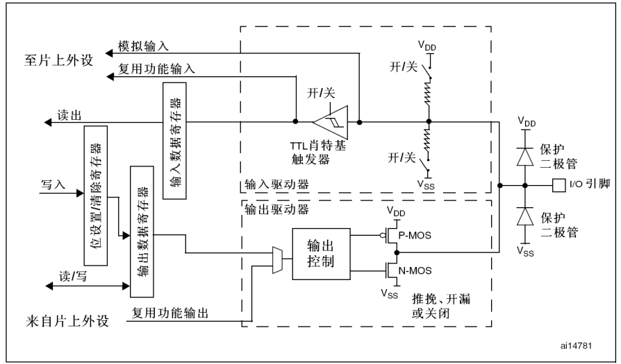

# GPIO 基础笔记

本文从 `STM32F1` 参考手册 `RM0008` 的 `GPIO` 章节出发，整理 GPIO 的基本概念、常见模式，以及上拉、下拉、推挽、开漏这些学习时最容易混在一起的术语。

主要参考资料：

- ST 参考手册 `RM0008`
- 官方文档页面：<https://www.st.com/resource/en/reference_manual/cd00171190.pdf>
- 对应主题页：[GPIO](./gpio/README.md)

## 1. GPIO 是什么

`GPIO` 是 `General Purpose Input Output` 的缩写，通常翻译为“通用输入输出口”。它最基础的作用只有两件事：作为输入口读取外部电平，或者作为输出口向外部输出高低电平。

在 `STM32` 里，一个引脚通常不只具有 GPIO 这一种用途。同一个引脚还可能复用成串口、定时器、`SPI`、`I2C`、`ADC` 等功能，所以可以把 GPIO 理解成“引脚最基础、最通用的工作方式”。

## 2. GPIO 能做什么

最常见的 GPIO 用法包括点亮 `LED`、读取按键状态、输出控制信号、模拟简单通信时序，以及作为片上外设的引脚入口。因为它最直观，也最容易看到结果，所以 GPIO 往往是学习 `STM32` 时最先接触的内容。

### 2.1 GPIO 结构图里的关键模块

为了方便读懂上面的 GPIO 结构图，可以先认识几个最关键的内部模块。

#### 保护相关

| 模块 | 基本作用 | 直观理解 | 说明 |
|---|---|---|---|
| 保护二极管 | 把引脚电压钳位在安全范围附近 | 电压异常时先帮忙泄放一部分电流 | 通常分别接到 `VDD` 和 `VSS`，主要用于过压和静电保护，不能把它当成正常功能电路使用 |

#### 输入通路

| 模块 | 基本作用 | 直观理解 | 说明 |
|---|---|---|---|
| 施密特触发器 | 把边沿不够干净的输入信号整理成稳定数字电平 | 像一个带迟滞的整形门限 | 对抗毛刺和抖动很重要，能避免输入在门限附近来回跳变 |
| 输入缓冲器 | 把引脚上的外部电平送进芯片内部逻辑 | 把外部信号“读进来” | 数字输入模式下会经过这里；模拟输入时通常关闭这条数字通路以减少干扰和功耗 |
| 上拉/下拉网络 | 给输入引脚提供默认电平 | 轻轻把引脚拉向高电平或低电平 | 主要作用是避免输入悬空，按键输入里最常见 |

#### 复用通路

| 模块 | 基本作用 | 直观理解 | 说明 |
|---|---|---|---|
| MUX | 在多条内部信号路径中做选择 | 像一个切换开关 | 决定当前引脚接到普通 `GPIO`、复用功能还是其他内部通路 |
| 片上外设 | 提供串口、定时器、`SPI`、`I2C` 等专用功能 | 芯片内部已经做好的功能模块 | 当引脚切换到复用功能后，真正控制这个引脚行为的就是对应外设，而不是普通 GPIO 逻辑 |

#### 输出通路

| 模块 | 基本作用 | 直观理解 | 说明 |
|---|---|---|---|
| 输出驱动级 | 把芯片内部控制结果真正送到引脚上 | 把内部命令“推到引脚” | 推挽和开漏的核心区别，本质上就在输出驱动级内部结构不同 |

这里面学习 GPIO 时最值得优先理解的是：保护二极管负责保护，不负责正常驱动；施密特触发器负责把输入信号整理稳定；`MUX` 决定一个引脚当前到底接给谁使用。

## 3. GPIO 分类、常见模式与记忆重点

按照功能大类，`STM32F1` 的 GPIO 可以先分成输入模式、输出模式、复用功能模式和模拟模式。如果进一步细分，常见可以整理成 8 种配置方式。下面这个表适合做总览，也适合直接比较不同模式之间最关键的区别。

| 模式 | 类别 | 基本含义 | 原理或关键特点 | 常见用途 |
|---|---|---|---|---|
| Analog input | 输入 | 模拟输入 | 数字输入缓冲关闭，减少数字干扰和额外功耗，不再按数字高低电平解释信号 | `ADC` 输入、模拟信号采集 |
| Floating input | 输入 | 浮空输入 | 内部不上拉也不下拉，引脚电平完全由外部决定；外部若不稳定，就容易悬空 | 外部已提供稳定电平的数字输入 |
| Input with pull-up / pull-down | 输入 | 上拉/下拉输入 | 通过内部弱上拉或弱下拉给引脚一个默认状态，避免悬空 | 按键、开关量输入 |
| General purpose output push-pull | 输出 | 通用推挽输出 | 高低电平都能由芯片主动输出，因此驱动能力较强 | `LED`、普通数字输出 |
| General purpose output open-drain | 输出 | 通用开漏输出 | 只能主动拉低，不能主动拉高；高电平依赖外部上拉 | `I2C`、线与逻辑、共线控制 |
| Alternate function output push-pull | 复用输出 | 复用功能推挽输出 | 本质仍是推挽输出，但电平变化由外设控制 | `USART`、`SPI`、定时器输出 |
| Alternate function output open-drain | 复用输出 | 复用功能开漏输出 | 本质仍是开漏输出，但由外设控制 | `I2C` 等需要开漏特性的外设 |
| Alternate function input | 复用输入 | 复用功能输入 | 引脚不再作为普通 GPIO 读取，而是接到外设输入通道 | 串口接收、输入捕获等 |

补充记忆：

- 推挽输出：高低电平都能主动输出，驱动能力更强
- 开漏输出：只能主动拉低，输出高电平必须依赖上拉
- 上拉输入：默认偏高；下拉输入：默认偏低
- 浮空输入：默认没有确定状态，更容易受外部干扰

学习 GPIO 时，再顺手记住下面 5 句话，后面看寄存器配置或 CubeMX 选项就会更容易对上号：

1. GPIO 本质上就是“读电平”和“写电平”
2. 输入模式最重要的是：引脚会不会悬空
3. 输出模式最重要的是：推挽和开漏到底有什么区别
4. 上拉下拉的作用是给输入口一个默认状态
5. 复用模式表示这个引脚已经交给片上外设使用

## 4. 结合当前项目怎么理解

放到当前项目里，可以这样对应理解：

- `PC13` 板载 LED，适合用普通输出模式理解 GPIO 最基础的输出控制
- `PB8 / PB9` 用来连接 OLED，当前代码更接近“GPIO 拉高拉低配合软件时序”的思路
- `PA13 / PA14` 主要是下载和调试接口，不适合作为普通 GPIO 学习入口

所以这个项目现在正好适合练习普通输出、输入默认状态、引脚功能切换，以及 GPIO 和外设复用之间的区别。

## 5. 后续阅读建议

读完这一篇以后，建议继续关注：

1. GPIO 寄存器是怎么把这些模式配置进去的
2. `STM32F1` 的 `CRL / CRH / IDR / ODR / BSRR / BRR` 分别负责什么
3. `HAL_GPIO_Init()` 最终是怎样把这些配置写入寄存器的
