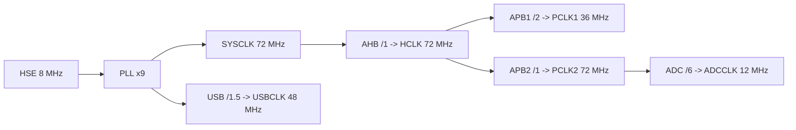
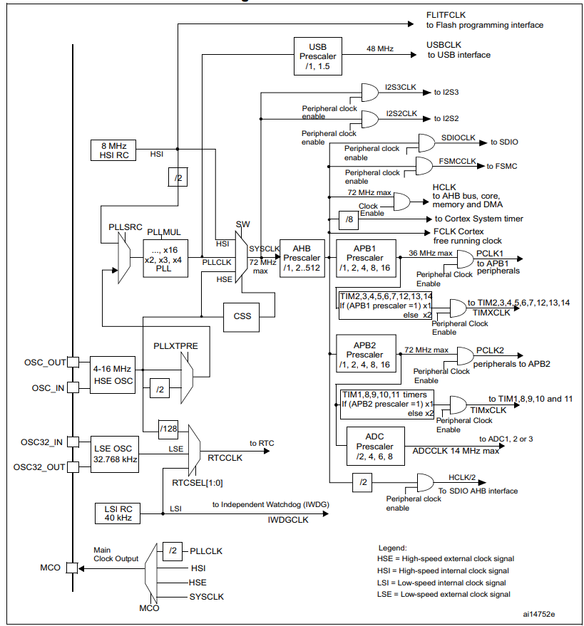

# Clock

`Clock` 是 STM32F103 最基础也最关键的主题之一。很多外设能不能正常工作，往往不是代码逻辑先出问题，而是时钟源、分频链路或者外设时钟没有配对。

## 1. 这是什么

可以先把时钟理解成 MCU 内部各个模块共同使用的“节拍系统”。

在 `STM32F103` 里，时钟问题通常要先分成 3 层来看：

- 时钟源从哪里来
- 系统时钟如何被分到 AHB、APB1、APB2
- 外设最终拿到的时钟是多少

如果只是第一次建立印象，先不要一上来就看完整时钟树。先抓住最常见的主链路就够了：

等这条主链路顺了，再回头看完整总览图会轻松很多：

## 2. 常见时钟源

| 缩写 | 全称 | 类型 | 常见频率 | 作用 | 说明 |
|---|---|---|---|---|---|
| `HSI` | `High-Speed Internal` | 内部高速时钟 | `8 MHz` | 上电默认系统时钟来源之一 | 方便启动，但精度一般 |
| `HSE` | `High-Speed External` | 外部高速时钟 | 常见 `8 MHz` | 常用于更稳定的主时钟输入 | 开发板上常接外部晶振 |
| `PLL` | `Phase-Locked Loop` | 锁相环倍频输出 | 最高常见到 `72 MHz` | 把输入时钟倍频后作为系统时钟 | `STM32F103` 常见主频配置核心 |
| `LSI` | `Low-Speed Internal` | 内部低速时钟 | 约 `40 kHz` | 独立看门狗等低速功能 | 精度不高 |
| `LSE` | `Low-Speed External` | 外部低速时钟 | `32.768 kHz` | RTC 等低速时基 | 常用于实时时钟 |

## 3. 关键时钟链路

| 缩写 | 可直观理解为 | 含义 | 常见上限 | 典型去向 |
|---|---|---|---|---|
| `SYSCLK` | 整个系统的主时钟 | 系统时钟 | `72 MHz` | Cortex 内核和总线主链路起点 |
| `HCLK` | AHB 这一层真正拿到的时钟 | AHB 时钟 | `72 MHz` | 内核、存储器、DMA、AHB 外设 |
| `PCLK1` | APB1 低速外设总线时钟 | APB1 低速总线时钟 | `36 MHz` | `TIM2~TIM7`、USART2/3、I2C、CAN 等 |
| `PCLK2` | APB2 高速外设总线时钟 | APB2 高速总线时钟 | `72 MHz` | GPIO、ADC、USART1、TIM1、SPI1 等 |
| `ADCCLK` | ADC 模块真正工作的时钟 | ADC 时钟 | 需按手册限制配置 | ADC1/ADC2 |
| `USBCLK` | USB 模块真正工作的时钟 | USB 时钟 | `48 MHz` | USB 外设 |

这里最容易先记住两件事：

- `APB1` 不能超过 `36 MHz`
- `APB2` 可以到 `72 MHz`

## 4. 最常见的 72 MHz 配置

对很多 `STM32F103` 开发板，最常见的配置是：

| 项目 | 配置 |
|---|---|
| `HSE` | `8 MHz` |
| `PLL Source` | `HSE` |
| `PLLMUL` | `x9` |
| `SYSCLK` | `72 MHz` |
| `AHB Prescaler` | `/1` |
| `HCLK` | `72 MHz` |
| `APB1 Prescaler` | `/2` |
| `PCLK1` | `36 MHz` |
| `APB2 Prescaler` | `/1` |
| `PCLK2` | `72 MHz` |
| `ADC Prescaler` | `/6` |
| `ADCCLK` | `12 MHz` |
| `USB Prescaler` | `/1.5` |
| `USBCLK` | `48 MHz` |

## 5. 这个图应该怎么看

| 关注点 | 读图时看哪里 | 先理解什么 |
|---|---|---|
| 时钟源 | 左侧 `HSI / HSE / LSI / LSE` | 哪些时钟来自内部，哪些来自外部 |
| 主系统链路 | 中间 `PLL -> SYSCLK -> AHB` | 主频是怎么一步步形成的 |
| 总线分配 | `AHB -> APB1 / APB2` | 为什么不同外设跑在不同总线上 |
| 特殊外设时钟 | `USBCLK / ADCCLK / RTCCLK` | 这些外设经常有单独限制 |

## 6. 工作过程

把这条主链路换成一句更口语的理解就是：

- `HSE` 提供外部高速时钟输入
- `PLL` 把它倍频到系统主频
- `SYSCLK` 再分给 `AHB`
- `AHB` 再继续分给 `APB1` 和 `APB2`
- USB、ADC、定时器等模块再从这些总线时钟继续取各自需要的节拍

## 7. 一个很容易忽略的点

`TIM` 定时器时钟不一定等于 `PCLK`。

在 `STM32F103` 里：

| 情况 | 定时器时钟 |
|---|---|
| 如果对应 `APB` 预分频器为 `/1` | `TIMxCLK = PCLKx` |
| 如果对应 `APB` 预分频器不为 `/1` | `TIMxCLK = 2 x PCLKx` |

这也是很多人在算 `PWM`、定时器溢出时间、输入捕获频率时容易算错的地方。

## 8. 常见错误

| 问题 | 说明 |
|---|---|
| 只记 `SYSCLK`，不看 `PCLK1 / PCLK2` | 外设真正使用的是总线时钟，不一定直接等于主频 |
| 把 `APB1` 也配到 `72 MHz` | 对 `STM32F103` 来说超出常见允许范围 |
| 忘记 USB 必须拿到 `48 MHz` | USB 时钟不对时常常直接工作异常 |
| 忘记 ADC 也有独立分频 | ADC 时钟不能随便照搬 `PCLK2` |
| 误把定时器时钟当成 `PCLK` | `APB` 分频不为 `/1` 时，定时器时钟会翻倍 |

## 9. 结合当前项目理解

放到当前 STM32 项目里，可以先这样理解：

- 如果板子外部晶振是 `8 MHz`，最常见就是配成 `72 MHz`
- 后面你做 `PWM`、串口、I2C、延时、SysTick，都会受这里的时钟配置影响
- 如果某个外设“逻辑看起来对，但频率不对”，第一时间就该回头检查时钟树

## 10. 去哪里看原始资料

如果你想看官方原始时钟树，最值得直接看的资料是：

| 来源 | 说明 |
|---|---|
| [RM0008 Reference Manual](https://www.st.com/resource/en/reference_manual/cd00171190-stm32f101-103-105-107-stm32f100-series-armbased-32bit-mcus-stmicroelectronics.pdf) | 看 RCC 与官方时钟树，总体最完整 |
| [STM32F103x8/xB Datasheet](https://www.st.com/resource/en/datasheet/stm32f103r8.pdf) | 适合快速看器件级时钟树和频率限制 |
| [图片需求清单](./references/image-plan.md) | 整理这页后续还适合补哪些图 |
| [图片提示词](../../../../docs/IMAGE_REGEN_PROMPTS.md) | 全仓库统一的图片重生成提示词总表 |

## 11. 关联内容

| 类型 | 内容 | 说明 |
|---|---|---|
| 已有关联 | [GPIO](../gpio/README.md) | GPIO 的速度、外设复用都依赖时钟链路 |
| 已有关联 | [PWM](../../signals/pwm/README.md) | 定时器输出频率直接依赖时钟计算 |
| 后续主题 | `Interrupts` | SysTick 与中断节拍和时钟相关 |
| 后续主题 | `Timers` | 定时器分频、计数和时钟树强相关 |
