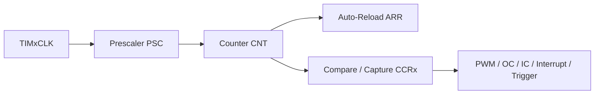
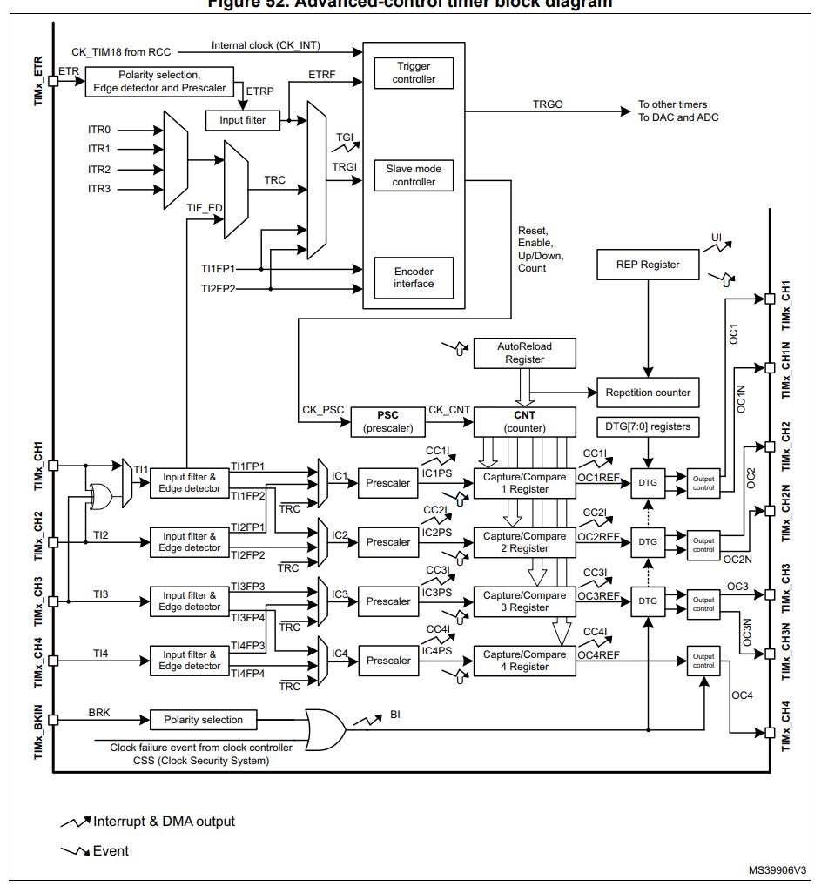

# Timers

`Timers` 是 STM32F103 里最值得早点吃透的一组外设。很多看起来彼此无关的功能，最后都会落到定时器上，比如：

- 基本定时
- 计数
- `PWM`
- 输入捕获
- 输出比较
- 编码器接口
- 定时触发 ADC

## 1. 这是什么

可以先把定时器理解成“一个会按节拍不断变化的计数器系统”。

最核心的理解入口只有 3 件事：

- 时钟从哪里来
- 计数器怎么加一或减一
- 计数结果如何拿去做比较、输出、捕获或触发

如果先只抓主链路，可以这样理解：

## 2. 在 STM32F103 里常见有哪些定时器

| 类型 | 典型实例 | 直观理解 | 常见用途 |
|---|---|---|---|
| Advanced-control timer | `TIM1` | 功能最强的一类 | 高级 PWM、互补输出、死区、刹车 |
| General-purpose timer | `TIM2` ~ `TIM5` | 最常用的一类 | 定时、PWM、输入捕获、输出比较 |
| Basic timer | `TIM6`、`TIM7` | 更偏纯定时基 | 周期中断、DAC 触发 |

对大多数入门场景，可以先盯住：

- `TIM2 / TIM3 / TIM4`：最常见、最适合做基础实验
- `TIM1`：后面做更复杂 PWM 时再深入

## 3. 先抓住哪些寄存器名字

| 缩写 | 名称 | 作用 |
|---|---|---|
| `PSC` | Prescaler | 预分频，决定计数节拍变慢多少 |
| `CNT` | Counter | 当前计数值 |
| `ARR` | Auto-Reload Register | 自动重装值，决定周期边界 |
| `CCR` | Capture / Compare Register | 用于比较输出或输入捕获记录 |
| `DIER` | DMA / Interrupt Enable Register | 控制定时器中断/DMA 使能 |
| `SR` | Status Register | 看是否发生更新、捕获、比较事件 |
| `CR1` | Control Register 1 | 基本工作模式控制 |

这里最重要的一句是：

- `PSC` 决定“走得多快”
- `ARR` 决定“多久回一轮”
- `CCR` 决定“在这一轮中的哪个位置触发动作”

## 4. 最常见的 3 种用法

| 用法 | 核心思路 | 常见输出结果 |
|---|---|---|
| 基本定时 | 让 `CNT` 周期性溢出 | 周期中断、定时任务 |
| 输出比较 / PWM | 把 `CNT` 和 `CCR` 比较 | 波形输出、占空比控制 |
| 输入捕获 | 把外部边沿到来时的 `CNT` 记下来 | 测频、测周期、测脉宽 |

## 5. 图片建议从哪里截图

如果你准备从官方文档截图，优先看下面这些资料：

| 来源 | 用途 | 说明 |
|---|---|---|
| [RM0008 Reference Manual](https://www.st.com/resource/en/reference_manual/cd00171190-stm32f101-103-105-107-stm32f100-series-armbased-32bit-mcus-stmicroelectronics.pdf) | 主资料 | STM32F103 最核心的定时器原始资料 |
| [AN4776 General-purpose timer cookbook](https://www.st.com/resource/en/application_note/an4776-generalpurpose-timer-cookbook-for-stm32-microcontrollers-stmicroelectronics.pdf) | 教学型资料 | 对定时器工作模式解释更直观 |
| [Getting started with TIM](https://wiki.st.com/stm32mcu/wiki/Getting_started_with_TIM) | 辅助理解 | ST 官方 wiki，适合补概念理解 |
| [截图建议清单](./references/screenshot-guide.md) | 本仓库配套 | 告诉你优先截什么、文件名怎么起 |

## 6. 这章最值得先补哪些图

| 优先级 | 图片 | 作用 |
|---|---|---|
| 高 | 定时器整体框图 | 建立“时钟 -> 预分频 -> 计数 -> 比较/捕获”的整体认识 |
| 高 | 计数时序图 | 理解 `PSC / ARR / CNT` 的关系 |
| 中 | PWM 模式结构图 | 帮助和 `signals/pwm` 章节互相对照 |
| 中 | 输入捕获时序图 | 后面讲测频、测周期时很好用 |
| 中 | 输出比较时序图 | 解释比较事件何时发生 |

当前已收录一张更偏进阶视角的官方块图：

这张图适合说明：

- 高级控制定时器的内部模块很多
- `PSC / CNT / ARR / CCR` 只是其中一部分
- 触发、刹车、编码器接口、死区控制等功能是逐层叠加上去的

但它不适合作为本章第一张入门图，因为信息密度偏大，更适合在你已经理解基本链路后再回来看。

## 7. 一个最容易忽略的点

定时器真正的输入时钟不是随手假设的，它来自时钟树。

尤其在 `STM32F103` 里：

- 如果 `APB` 预分频器为 `/1`，通常 `TIMxCLK = PCLKx`
- 如果 `APB` 预分频器不为 `/1`，通常 `TIMxCLK = 2 x PCLKx`

这一步一旦算错，后面的定时、PWM、输入捕获结果都会一起错。

## 8. 常见错误

| 问题 | 说明 |
|---|---|
| 只配 `ARR`，不看 `PSC` | 周期不一定是你直觉里的那个值 |
| 把定时器时钟直接当系统时钟 | 实际上中间还隔着总线和分频 |
| 只会用 PWM，不理解 `CNT/ARR/CCR` 关系 | 后面一遇到输入捕获或比较就容易断层 |
| 把输入捕获和外部中断混在一起 | 两者都能响应边沿，但目的完全不同 |

## 9. 结合当前项目理解

放到你当前这套资料里，`Timers` 很适合放在：

- `Clock` 之后
- `PWM` 之前或并行理解

更顺的顺序通常是：

1. 先理解时钟树
2. 再理解定时器时钟从哪里来
3. 然后理解 `PSC / ARR / CNT / CCR`
4. 最后再去看 `PWM`、输入捕获、输出比较

## 10. 关联内容

| 类型 | 内容 | 说明 |
|---|---|---|
| 已有关联 | [Clock](../clock/README.md) | 定时器时钟计算的前提 |
| 已有关联 | [PWM](../../signals/pwm/README.md) | PWM 是定时器最常见的应用之一 |
| 后续主题 | `Interrupts` | 定时器更新中断会和 NVIC 结合 |
| 后续主题 | `ADC` | 定时器也常用于触发 ADC |
