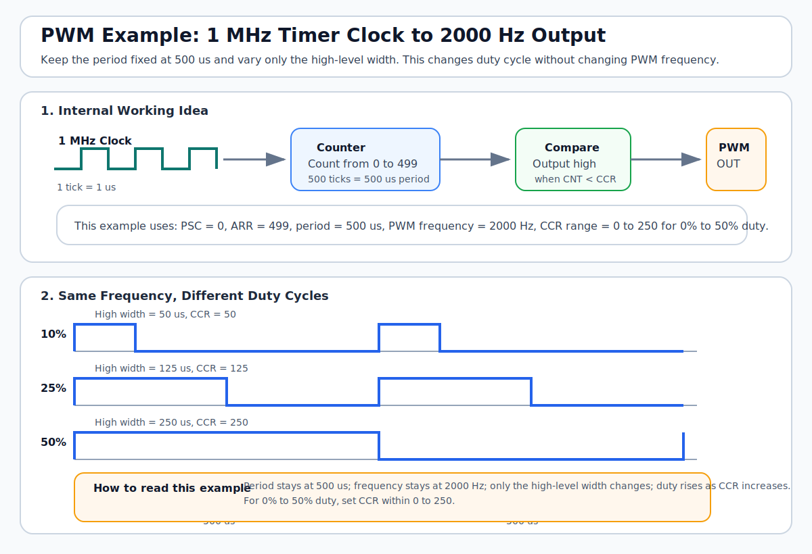

# PWM

`PWM` 是 `Pulse Width Modulation`，通常翻译为“脉宽调制”。它的核心不是改变输出高电平幅值，而是在固定周期内改变高电平持续时间，也就是占空比。

## 1. 这是什么

在 MCU 里，`PWM` 最常见的来源是定时器输出比较功能。可以先把它理解成一条很简单的链路：

- 定时器按固定时钟节拍计数
- 计数周期决定 `PWM` 频率
- 比较值决定高电平持续多久

下面这张图用一个具体例子说明：输入时钟 `1 MHz`，目标 `PWM = 2000 Hz`，占空比在 `0% ~ 50%` 之间变化。

## 2. 这个例子怎么算

这页先按常见的 STM32 边沿对齐 `PWM` 思路理解。

| 项目 | 数值 | 说明 |
|---|---|---|
| 定时器输入时钟 | `1 MHz` | 也就是每个计数节拍 `1 us` |
| 目标 PWM 频率 | `2000 Hz` | 周期应为 `500 us` |
| 预分频 `PSC` | `0` | 不再分频，计数时钟仍是 `1 MHz` |
| 自动重装值 `ARR` | `499` | 计数 `500` 个节拍后进入下一个周期 |
| 占空比范围 | `0% ~ 50%` | 高电平宽度在 `0 us ~ 250 us` 之间变化 |

## 3. 关键关系

| 关系 | 公式 | 带入本例 |
|---|---|---|
| PWM 频率 | `f_pwm = f_tim / ((PSC + 1) * (ARR + 1))` | `1,000,000 / (1 * 500) = 2000 Hz` |
| PWM 周期 | `T_pwm = 1 / f_pwm` | `1 / 2000 = 500 us` |
| 占空比 | `duty = high_time / period` | `high_time / 500 us` |
| 比较值范围 | `CCR = duty * (ARR + 1)` | `0% ~ 50%` 对应 `0 ~ 250` |

这里可以直接记一件事：

- `ARR` 决定“一个周期有多长”
- `CCR` 决定“这一周期里高电平持续多久”

## 4. 这个图应该怎么看

| 关注点 | 读图时看哪里 | 先理解什么 |
|---|---|---|
| 时钟输入 | 顶部 `1 MHz Clock` | 定时器每 `1 us` 走一个计数节拍 |
| 周期生成 | 中间 `Counter 0..499` | 计满 `500` 个节拍就是一个 PWM 周期 |
| 比较输出 | 中间 `Compare CNT < CCR` | 计数器小于比较值时输出高电平 |
| 占空比变化 | 底部 `10% / 25% / 50%` 波形 | 周期不变，只改变高电平宽度 |

## 5. 常见用途

| 用途 | 说明 |
|---|---|
| LED 调光 | 改变平均功率，视觉上表现为亮度变化 |
| 电机调速 | 通过占空比调节平均驱动能力 |
| 蜂鸣器驱动 | 频率决定音调，占空比影响能量分布 |
| DAC 替代方案 | 配合低通滤波，可近似输出模拟平均值 |

## 6. 常见错误

| 问题 | 说明 |
|---|---|
| 只改 `CCR` 不改 `ARR` | 这只会改变占空比，不会改变 PWM 频率 |
| 频率算对了但分辨率太差 | `ARR` 太小会导致占空比步进过粗 |
| 忘记区分时钟频率和 PWM 频率 | `1 MHz` 是计数时钟，不是最终输出频率 |
| 直接拿 GPIO 翻转当 PWM | 软件翻转能做演示，但稳定性和精度不如定时器硬件 PWM |

## 7. 结合当前项目理解

放到 STM32 项目里，可以把这个例子理解成：

- 先让某个定时器以 `1 MHz` 节拍计数
- 设置 `PSC = 0`
- 设置 `ARR = 499`
- 再让 `CCR` 在 `0 ~ 250` 之间变化

这样输出频率固定为 `2000 Hz`，占空比就在 `0% ~ 50%` 之间线性变化。

## 8. 参考资料

| 来源 | 说明 |
|---|---|
| [ST RM0008](https://www.st.com/resource/en/reference_manual/cd00171190.pdf) | STM32F1 参考手册，定时器 `PWM mode` 原理参考 |
| [ST General-purpose timer training](https://www.st.com/resource/en/product_training/STM32L4_WDG_TIMERS_GPTIM.pdf) | ST 官方培训资料，给出 `PSC / ARR / CCR` 与 PWM 频率、占空比的关系 |
